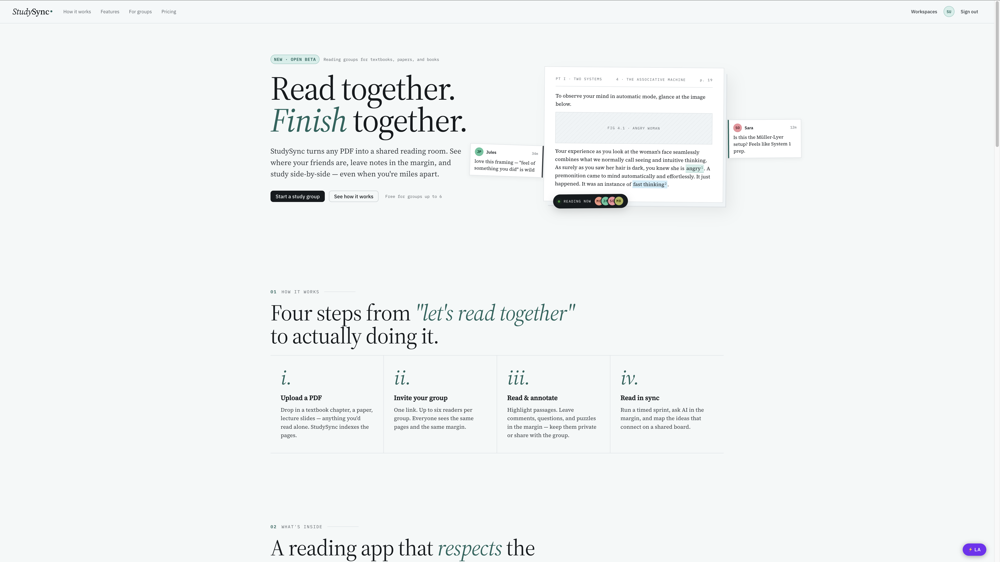
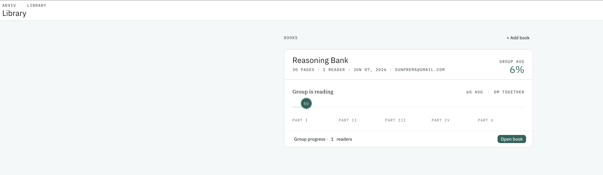
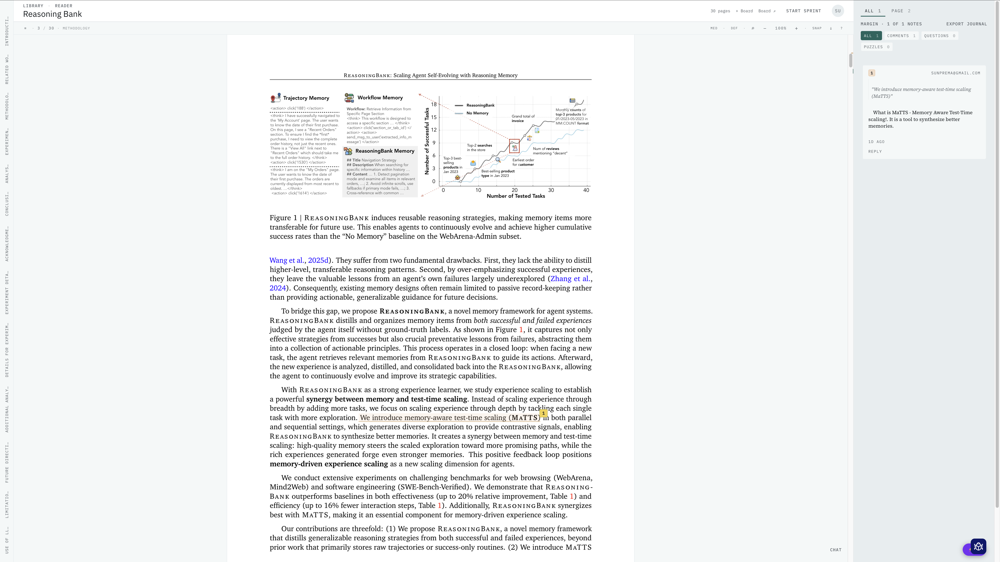
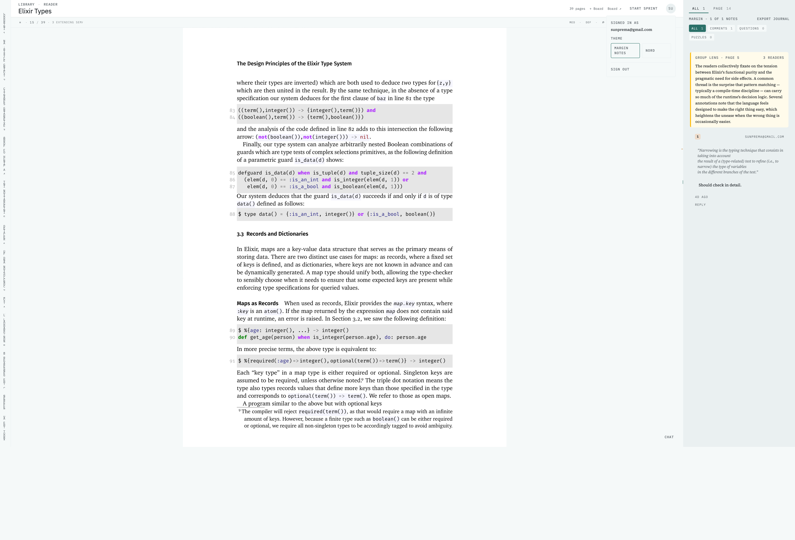
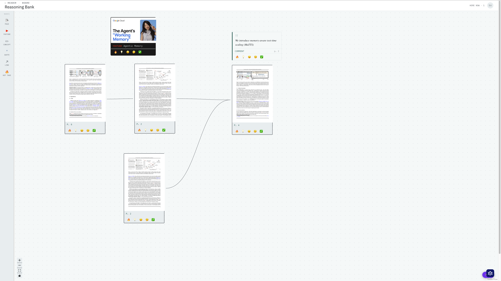

# StudySync

A collaborative, AI-assisted study platform centered on PDF-based learning. A reading group uploads a book, reads it together asynchronously, anchors discussion to specific passages via annotations, and tracks progress through milestones and rubber stamps.

The core loop: **Read → Highlight → Annotate → Discuss → AI → Save → Progress.**

## Screenshots

**Home page**

**Group progress**

**PDF reader** — margin notes, milestones with rubber stamps, and the transient study-room chat panel

**Collective Insight** — the amber "Group Lens" card synthesizes multiple readers' notes on a shared page

**Concept map board** — PDF pages and rich nodes (text, quote, link, YouTube, hot take) connected on a SvelteFlow canvas

---

## Design direction

StudySync ships **Direction 01 — Margin Notes**: a classical book-margin metaphor. Annotations live in a literal margin column to the right of the page, anchored via footnote-style numbered markers (¹, ², ³) inline in the prose. Warm, literary, paper-cream surface with terracotta as the lone accent.

Two themes are available: `study_sync_default` (Margin Notes, default) and `nord` (opt-in alternate). Users switch from the avatar dropdown.

## Features

- **PDF reader** — three-column reader (chapter rail · page surface · margin column) with page virtualization, smooth scrolling, keyboard shortcuts, and a chapter rail built from the PDF outline.
- **Annotations & threads** — anchor comments, questions, and puzzles to passages; reply in threads; private or workspace-visible. Footnote markers in the prose map 1:1 to numbered cards in the margin, with bi-directional click/hover sync.
- **AI assistant ("Ask AI")** — ask a question against a passage; an Oban worker calls the Anthropic API and writes back an AI reply in the annotation thread.
- **Collective Insight ("Group Lens")** — when 3+ readers annotate the same page, a background job synthesizes their notes into a single amber-tinted insight card in the margin.
- **Reading sprints** — start a timed, synchronized reading session over a page range; others join, a live countdown runs in the header, and a "compare notes" modal surfaces everyone's sprint-window annotations when time's up.
- **Reading journal export** — download a reader's annotations for a resource as a typeset PDF (Typst template, cover page, per-page annotation cards with passages and replies).
- **Transient study-room chat** — an in-reader chat panel backed by an ETS ring buffer (non-persistent, gone on restart) with a live "here now" presence count.
- **Concept map board** — a per-resource SvelteFlow canvas where readers place PDF pages as thumbnail nodes and connect them. Supports page, text, quote, link, YouTube, and "hot take" node types, plus emoji reactions on nodes.
- **Real-time everywhere** — annotations, comments, stamps, insights, sprints, chat, and board changes broadcast over Phoenix PubSub and patch open readers live.

## Domain model

- **Workspace** — top-level tenant with members (`:admin`, `:member`).
- **Resource** — an uploaded PDF belonging to a workspace.
- **Annotation** — first-class object anchored to `(resource, page_number, rect)`. Has a type (`:comment | :question | :puzzle | :ai_response`), color, visibility, captured text snippet, and user.
- **AnnotationComment** — a reply within an annotation's thread. AI replies set `is_ai_response: true`.
- **MilestoneMarker** — admin-placed checkpoint anchored to `(resource, page, position)`.
- **RubberStamp** — a user's completion mark against a milestone.
- **CollectiveInsight** — AI synthesis of multiple readers' annotations on a shared page.
- **Sprint** / **SprintMember** — a timed, synchronized reading session over a page range and its participants.
- **Board.Node** / **Board.Edge** / **Board.Reaction** — concept-map nodes (page, text, quote, link, YouTube, hot-take), their connections, and reactions.
- **Chat.Message** — a transient study-room chat message held in an ETS ring buffer (not persisted, no Ash resource).

## Stack

- **Backend / UI** — Elixir + Phoenix LiveView
- **Resource layer** — Ash Framework (system of record for resources, actions, and policies)
- **Interactive UI** — Svelte 5 via Live Svelte (only the PDF canvas)
- **Database** — PostgreSQL
- **Background jobs** — Oban
- **Real-time** — Phoenix PubSub + LiveView
- **Styling** — Tailwind CSS v4 + DaisyUI v5
- **PDF rendering** — PDF.js inside the Svelte canvas component
- **Concept map** — SvelteFlow (`@xyflow/svelte`)
- **AI** — Anthropic API (via `req`), called from Oban workers
- **PDF export** — Typst (reading journal)

## Architecture

- LiveView owns page composition, navigation, forms, lists, and panels.
- Svelte is reserved for high-frequency DOM work: `PdfCanvasRenderer` owns PDF rendering, text selection, highlight overlays, and markers; `ConceptMapBoard` owns the concept-map canvas (a separate screen).
- Real-time updates broadcast over Phoenix PubSub, scoped per resource (`"resource:#{resource_id}"`, plus `:board` and `:chat` sub-topics).
- AI assistant calls and any work >150ms run as Oban jobs.

## Getting started

To start your Phoenix server:

- Run `mix setup` to install and setup dependencies
- Start Phoenix endpoint with `mix phx.server` or inside IEx with `iex -S mix phx.server`

Then visit [`localhost:4000`](http://localhost:4000) from your browser.
